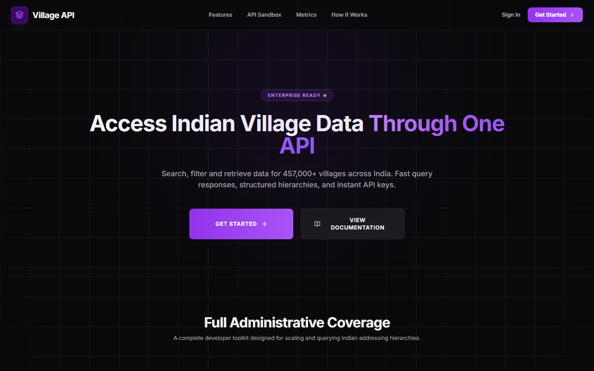
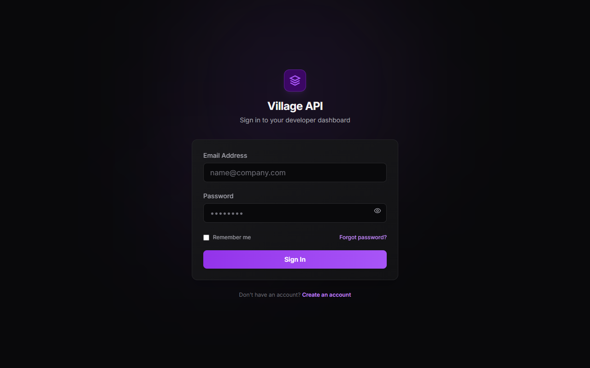
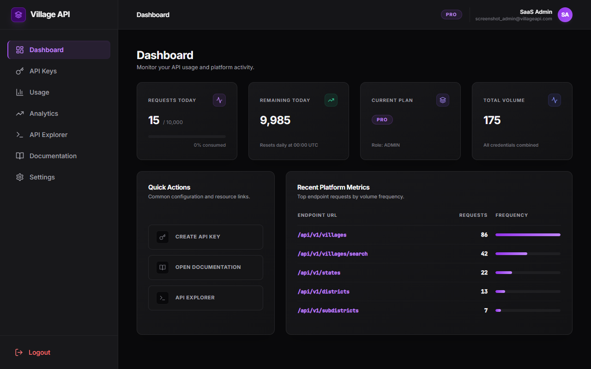
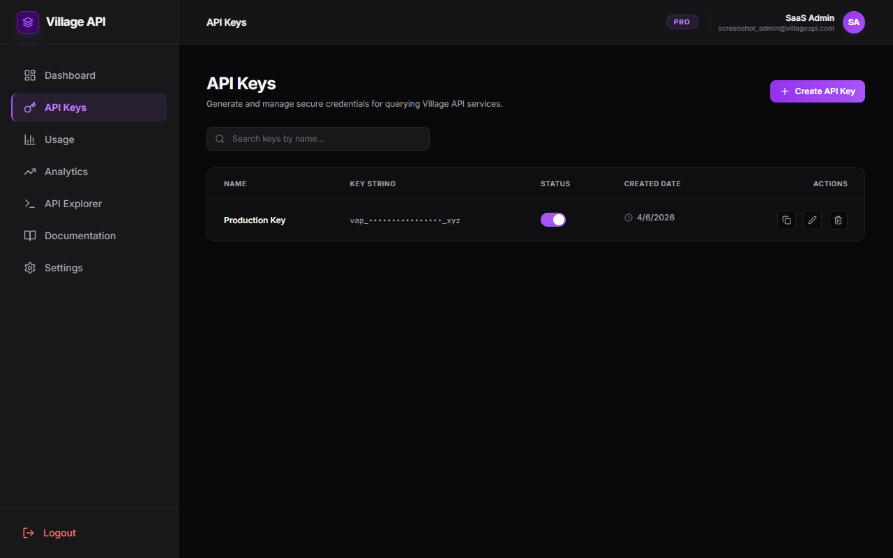
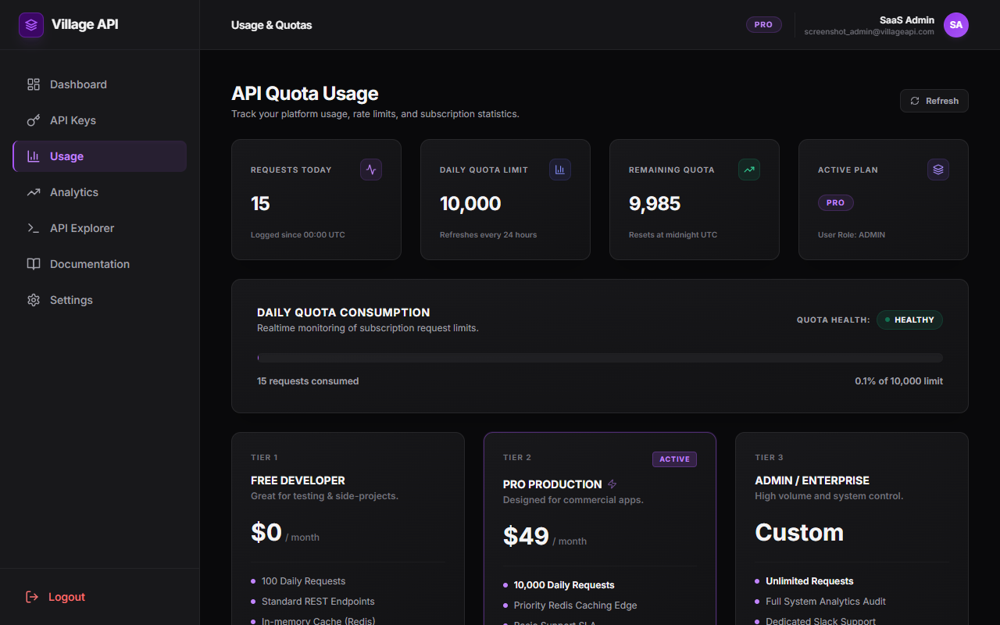
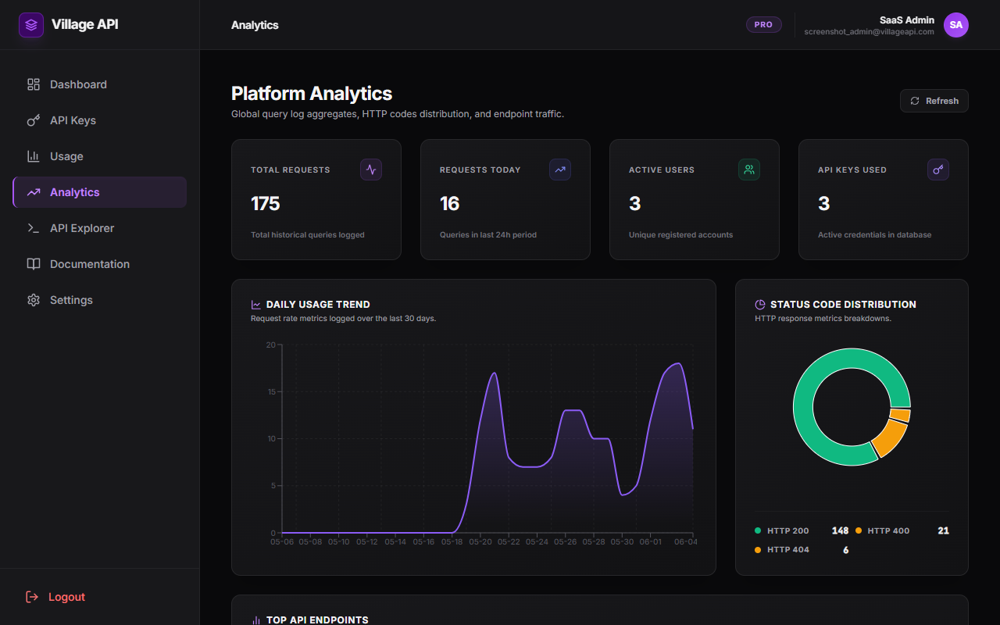
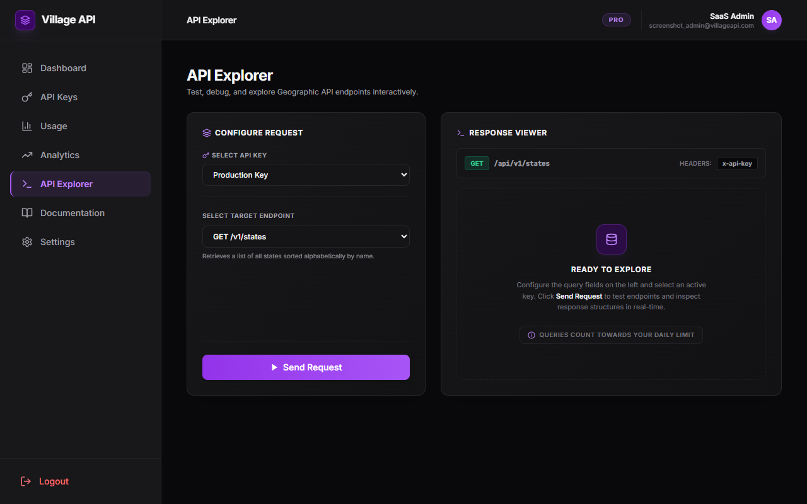
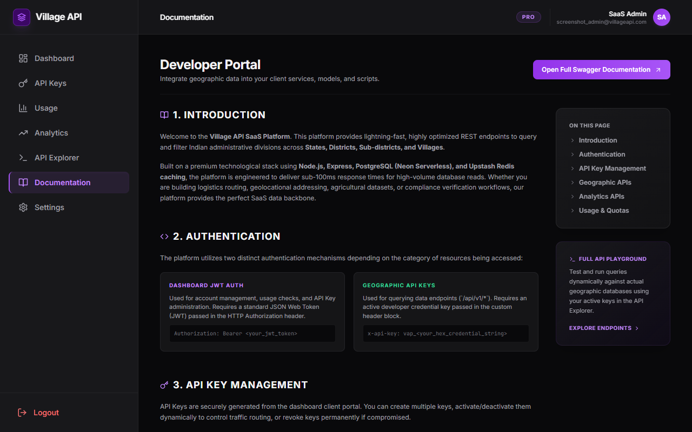
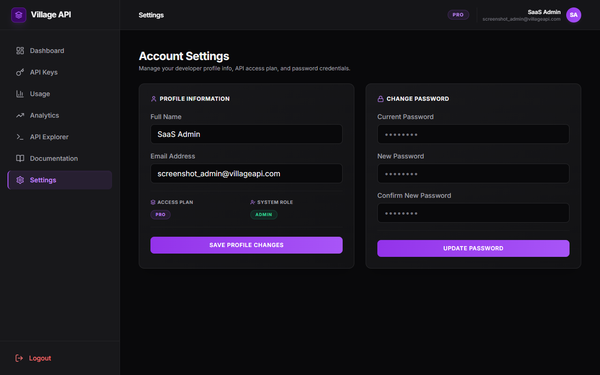

# Village API: Indian Administrative Divisions Database & SaaS Platform

A high-performance, developer-friendly developer portal and REST API platform providing administrative address records for over **457,000+ Indian villages** across **600+ districts** and **36 States & Union Territories**.

---

## 🚀 Technology Stack

### Backend
* **Runtime**: Node.js & Express
* **Database**: PostgreSQL (hosted on Neon Serverless)
* **ORM**: Prisma Client
* **Caching**: Redis (hosted on Upstash Redis Edge)
* **Security & Auth**: JWT (JSON Web Tokens), BCrypt password hashing, Helmet headers protection, and CORS controls.
* **Documentation**: OpenAPI Swagger Specification (`/api-docs` endpoint)

### Frontend
* **Core**: React 18 & Vite
* **Styling**: TailwindCSS & Custom Modern Glassmorphic CSS
* **Charts**: Recharts (dynamic traffic area graphs, status code pie distribution, endpoint frequency bars)
* **Iconography**: Lucide React

---

## 📸 Platform Visual Walkthrough

### 1. Public Landing Page
The landing page features a dark grid theme with custom gradient layouts, product statistics counters, and a fully interactive live API query sandbox.


### 2. Login Page
Secure developer authentication console with JWT token session generation.


### 3. Developer Dashboard
Overview of daily request limits, remaining credits, current tier plan, and top endpoints used by the developer's keys.


### 4. API Credentials Management
Create, toggle activation state, rename, or revoke API keys safely.


### 5. API Quotas & Usage Tracking
Dynamic indicator bar tracking current daily usage limits with automatic warning levels (amber at >80% usage and critical alert at >95% usage).


### 6. Platform Analytics Dashboard
Comprehensive system traffic statistics, response status code distributions, and active endpoint queries list for administrative users.


### 7. Interactive API Explorer
Test and inspect raw JSON payloads returned by geographic endpoints directly inside the developer dashboard.


### 8. Integration Documentation
cURL code templates, endpoints descriptions, parameters tables, and quick navigation headers sidebar.


### 9. Account Settings
Manage name, email profile coordinates, and update account passwords.


---

## 🛠️ Application Setup & Local Launch

### Prerequisites
* Node.js (v20+)
* PostgreSQL instance
* Redis instance (optional; will fallback automatically to local in-memory cache if Upstash variables are empty)

### Environment Configuration (`.env`)
Create a `.env` file in the root workspace with:
```env
PORT=3000
DATABASE_URL="your-postgresql-connection-string"
JWT_SECRET="your-jwt-auth-signing-key"
UPSTASH_REDIS_REST_URL="your-upstash-redis-url"
UPSTASH_REDIS_REST_TOKEN="your-upstash-redis-token"
NODE_ENV="development"
```

### Installation
1. Install root dependencies and generate Prisma client:
   ```bash
   npm install
   npx prisma generate
   ```
2. Setup and install frontend dependencies:
   ```bash
   cd frontend
   npm install
   ```

### Running Locally
* **Start Backend Server**:
  ```bash
  npm run start # from root folder
  ```
  *(Launches server on port `3000`)*
* **Start Frontend Server**:
  ```bash
  cd frontend
  npm run dev
  ```
  *(Launches Vite dev server on port `5173` with proxy configurations pointing to the backend)*

---

## 📡 API Endpoints Reference

### 1. Authentication (`/api/auth`)
* `POST /register`: Create a new developer account.
* `POST /login`: Log in to retrieve JWT access token.

### 2. User & Profile (`/api/users`)
* `GET /me`: Fetch authenticated user profile settings.
* `PUT /profile`: Update name or email parameters.
* `PUT /password`: Reset account credentials (requires current password validation).

### 3. API Keys (`/api/keys`)
* `POST /`: Generate a new secure hex API Key (`vap_...`).
* `GET /`: Retrieve all credentials created by the user.
* `PATCH /:id`: Edit name or toggle `isActive` activation status.
* `DELETE /:id`: Revoke/delete credential.

### 4. Geographic APIs (`/api/v1`)
*All geographic endpoints require a valid API key sent inside the `x-api-key` header.*
* `GET /states`: Get list of all states and UTs.
* `GET /districts?stateCode=XX`: Get districts of a specific state.
* `GET /subdistricts?districtCode=XXXX`: Get sub-districts inside a district.
* `GET /villages`: Paginated list of villages, filterable by state, district, or sub-district.
* `GET /villages/search?q=query`: Fuzzy partial name village lookup (capped at 20 matches).
* `GET /villages/:villageCode`: Get detailed record of a single village with full parent chain address.

### 5. Quotas & Analytics (`/api/usage` & `/api/analytics`)
* `GET /api/usage/me`: Fetch current daily request volume and remaining credits.
* `GET /api/analytics/summary`: Overall request logs counts (ADMIN only).
* `GET /api/analytics/endpoints`: Detailed route traffic logs (ADMIN only).
* `GET /api/analytics/status-codes`: Logged status codes counts (ADMIN only).
* `GET /api/analytics/daily`: 30-day request traffic trend logs (ADMIN only).

### 6. System & Status
* `GET /health`: Returns connection health status for Prisma database and Redis cache.
* `GET /api/system/info`: Returns host runtime node version, uptime metrics, and active node environment.
